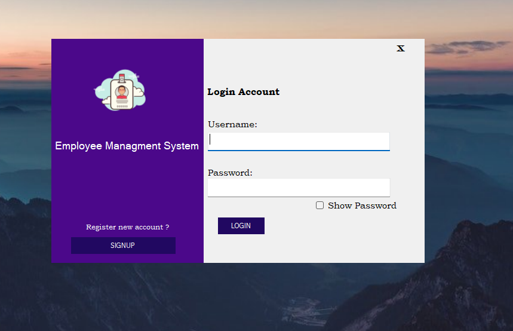
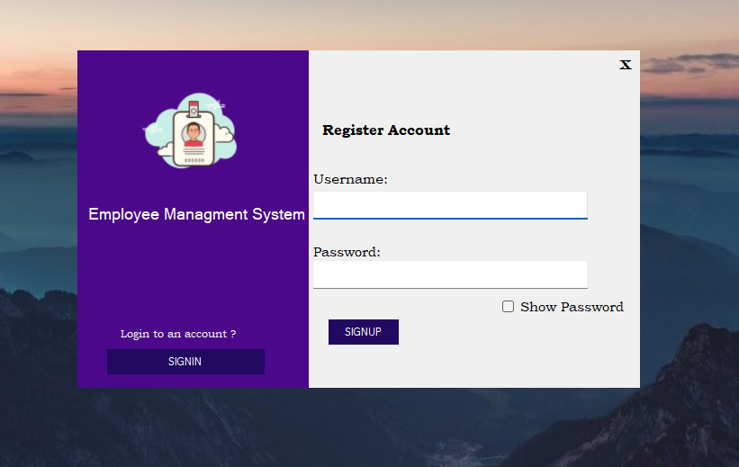
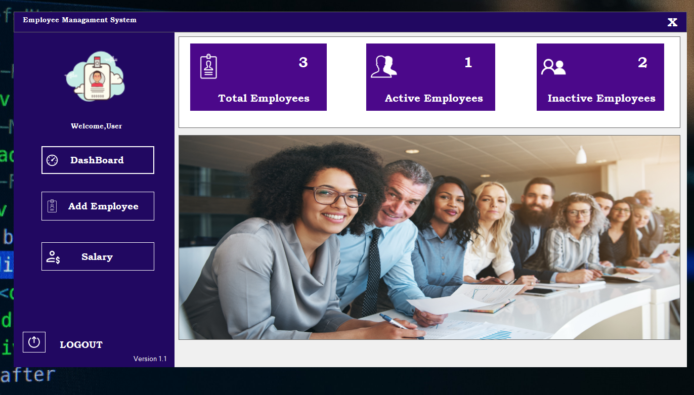
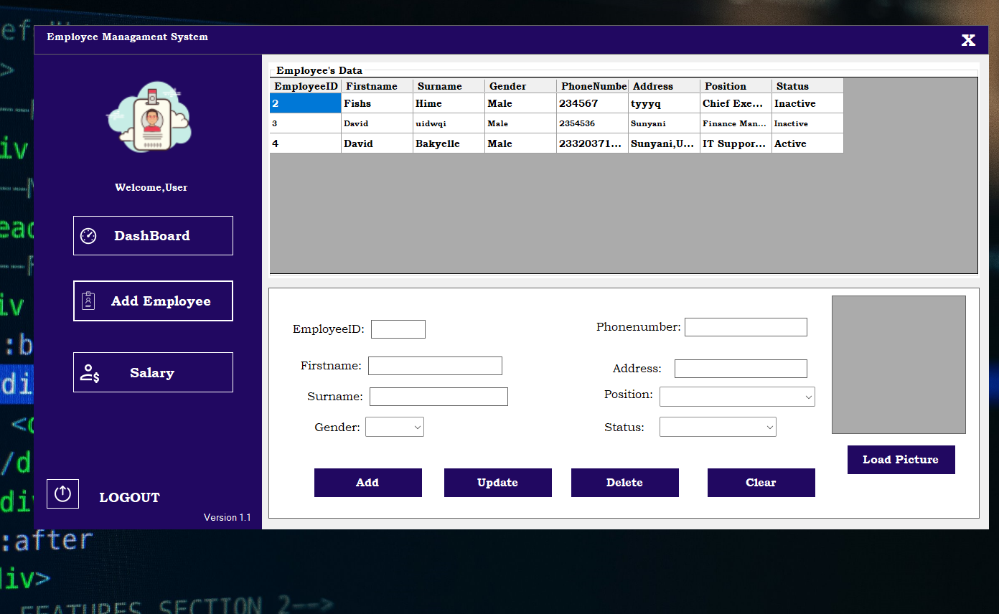
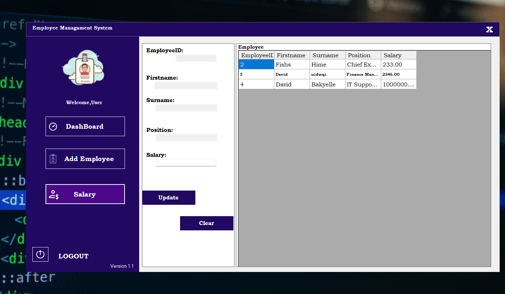

# Employee Management System (EMS) Documentation

## Table of Contents
1. Introduction
2. System Requirements
3. System Features
4. Database Design
5. User Interface
6. Functionalities
7. Security Measures
8. Installation & Setup
9. Key VB.NET Classes
10. Conclusion

---

## 1. Introduction
The **Employee Management System (EMS)** is a desktop application developed using **VB.NET** and **SQL Server**. This system allows a manager to efficiently manage employee records, including adding, updating, and deleting employee details. Additionally, it provides salary management functionality. The system ensures security with a login and signup mechanism, and the database maintains only two tables (**Users** and **Employees**) for streamlined auditing.

## 2. System Requirements
### Hardware Requirements:
- Processor: Intel Core i3 or higher
- RAM: 4GB or more
- Hard Disk: Minimum 10GB of free space

### Software Requirements:
- Windows Operating System (Windows 7 or later)
- **VB.NET** Framework
- **Microsoft SQL Server** (2016 or later)
- **Visual Studio** (2019 or later)

## 3. System Features
- **User Authentication**
  - Login System (For Managers only)
  - Signup System (To register new managers)
  - Password hide/show functionality
- **Dashboard**
  - Displays total number of employees
  - Shows active and inactive employees count
- **Employee Management**
  - Add, Update, and Delete employee records
- **Salary Management**
  - Add salary details for employees
- **Audit Support**
  - Only two tables (**Users** and **Employees**) to simplify record-keeping and auditing

## 4. Database Design
The database consists of two tables:

### **Users Table**
```sql
CREATE TABLE Users (
    UserID INT IDENTITY(1,1) PRIMARY KEY,
    Username NVARCHAR(20) NOT NULL UNIQUE,
    PasswordHash NVARCHAR(20) NOT NULL,
    CreatedAt DATETIME DEFAULT GETDATE()
);
```
| Column Name   | Data Type  | Description |
|--------------|-----------|-------------|
| UserID       | INT (PK)  | Unique identifier for each user |
| Username     | NVARCHAR(20)  | Login username |
| PasswordHash | NVARCHAR(20)  | Encrypted password |
| CreatedAt    | DATETIME   | Timestamp of user creation |

### **Employees Table**
```sql
CREATE TABLE Employee (
    EmployeeID INT IDENTITY(1,1) PRIMARY KEY,
    Firstname NVARCHAR(50) NOT NULL,
    Surname NVARCHAR(50) NOT NULL,
    Gender NVARCHAR(10)  NOT NULL,
    PhoneNumber NVARCHAR(15) UNIQUE NOT NULL,
    Address NVARCHAR(255) NOT NULL,
    Position NVARCHAR(100) NOT NULL,
    Status VARCHAR(10) NOT NULL,
    Picture VARBINARY(MAX), -- To store image data 
    Salary DECIMAL(10,2) NULL, 
    InsertDate DATETIME DEFAULT GETDATE(),
    UpdateDate DATETIME NULL,
    DeleteDate DATETIME NULL
);
```
| Column Name   | Data Type  | Description |
|--------------|-----------|-------------|
| EmployeeID   | INT (PK)  | Unique identifier for each employee |
| Firstname    | NVARCHAR(50)  | Employee's first name |
| Surname      | NVARCHAR(50)  | Employee's last name |
| Gender       | NVARCHAR(10)  | Gender of the employee |
| PhoneNumber  | NVARCHAR(15) UNIQUE | Contact number |
| Address      | NVARCHAR(255) | Residential address |
| Position     | NVARCHAR(100) | Job position |
| Status       | VARCHAR(10) | Active / Inactive status |
| Picture      | VARBINARY(MAX) | Profile image |
| Salary       | DECIMAL(10,2) | Salary amount |
| InsertDate   | DATETIME | Timestamp of record creation |
| UpdateDate   | DATETIME | Timestamp of last update |
| DeleteDate   | DATETIME | Timestamp of deletion (if applicable) |

## 5. User Interface

### **Login Form**

**A form with fields for username and password, along with a login button. It includes a hide/show password feature.
** 
### **Signup Form**

 **A form allowing new managers to create an account by entering a username and password. It includes a hide/show password feature.**

### **Dashboard Form**

 A main window displaying:
- Total employees count
- Active employees count
- Inactive employees count

### **Add Employee Form**

**A form with fields to enter employee details, including first name, surname, gender, phone number, address, position, and status, along with add/update/delete buttons.** 

### **Salary Form**

 **A form displaying:**
- Employee ID
- Firstname
- Surname
- Position
- Salary

## **6. System Modules & Functionality**  

### **6.1 Login & Signup**
- User enters credentials and logs in securely.
- New users can sign up to create an account.
- Passwords can be hidden or displayed.


* *  
**Login form with username field, password field with visibility toggle, and login buttons**
* * 
**SignUp form with username field, password field with visibility toggle, and Signup buttons.**


### **6.2 Dashboard Overview**
- Displays employee statistics dynamically from the database.
- Real-time metrics:  
  - Total Employees: `SELECT COUNT(*) FROM Employee WHERE DeleteDate IS NULL`  
  - Active Employees: `SELECT COUNT(*) FROM Employee WHERE Status = 'Active'`  
  - Inactive Employees: `SELECT COUNT(*) FROM Employee WHERE Status = 'Inactive'`  

**  
**Dashboard with three summary cards showing metrics in numeric and graphical format.**


### **6.3 Employee Management(Employees.vb)**
**CRUD Operations:**  
- **Add**: Inserts new record with `InsertDate`  
- **Update**: Modifies existing record, sets `UpdateDate`  
- **Delete**: Soft delete (sets `DeleteDate` instead of physical deletion)  
- **Photo Upload**: Converts image to VARBINARY  

**  
**Employee form with fields matching the database table, plus an image upload button and preview area.**


### **6.4 Salary Management (Salary.vb)**
- Displays: EmployeeID, Firstname, Surname, Position (read-only)  
- Editable: Salary field  
- Uses same Employee table  

**  
** Salary form with employee details in a read-only section and editable salary field with update button.**

### **6.5 Database Helper Class (EmployeeData.vb)**  
```vb
Public Class EmployeeData
    ' Define Properties for Employee
    Public Property EmployeeID As Integer
    Public Property Firstname As String
    Public Property Surname As String
    Public Property Gender As String
    Public Property Phonenumber As String
    Public Property Position As String
    Public Property Status As String
    Public Property Picture As Byte() ' Use Byte array for images
    Public Property Salary As Decimal

    ' Database Connection String
    Private ReadOnly connectionString As String = "Data Source=(LocalDB)\MSSQLLocalDB;AttachDbFilename=C:\Users\USER\source\repos\EMS\EMS\Employee.mdf;Integrated Security=True;Connect Timeout=30"

    ' Additional CRUD methods...
End Class
```

## 7. Security Measures
- **Password Encryption:** User passwords are stored in encrypted format.
- **User Authentication:** Only authenticated users can access the system.
- **Data Integrity:** Employee data is stored securely in SQL Server.

## 8. Installation & Setup
1. Install **Visual Studio** with **VB.NET**.
2. Install **SQL Server** and create the database using the provided SQL queries.
3. Configure database connection in the application.
4. Run the application and create a manager account.

## 9. Key VB.NET Classes
- **ScreenLogin.vb** – Handles authentication.
- **Main.vb** – Displays employee statistics.
- **Employees.vb** – Manages employee CRUD operations.
- **Salary.vb** – Handles salary assignments.
- **EmployeeData.vb** – Contains SQL connection and query methods.
- **Employee.mdf** - Database file.

## **10. Setup Guide**  

### **10.1 Prerequisites**  
- Visual Studio 2022  
- .NET Framework 4.7.2  
- SQL Server Express LocalDB  

### **10.2 Deployment Steps**  
1. Clone repository  
2. Build solution  
3. Ensure `Employee.mdf` is in EmployeeManagementSystem folder  
4. Run application  

---

## **11. Audit Trail Mechanism**  
The system tracks:  
- Account creation (`Users.CreatedAt`)  
- Employee record changes (`Employee.InsertDate`, `UpdateDate`)  
- Deletions (`Employee.DeleteDate` for soft delete)  

**Sample Audit Query:**  
```sql
SELECT EmployeeID, Firstname, Surname, 
       CASE WHEN DeleteDate IS NOT NULL THEN 'Deleted' ELSE Status END AS CurrentStatus,
       InsertDate, UpdateDate, DeleteDate
FROM Employee
ORDER BY InsertDate DESC
```

---

## **12. Troubleshooting**  

| Issue | Solution |  
|-------|----------|  
| Login fails | Verify password hash matches database |  
| Image upload fails | Check file size (<2MB recommended) |  
| Salary update error | Ensure EmployeeID exists |  

---

## **13. Future Enhancements**  
1. Password recovery system  
2. Role-based dashboards  
3. Export to PDF/Excel functionality  

## 10. Conclusion
The **Employee Management System** provides a simple and efficient way to manage employees and salaries. The system ensures security through authentication and simplifies auditing with minimal database tables. The structured database and key VB.NET classes ensure smooth operation and easy maintenance.

